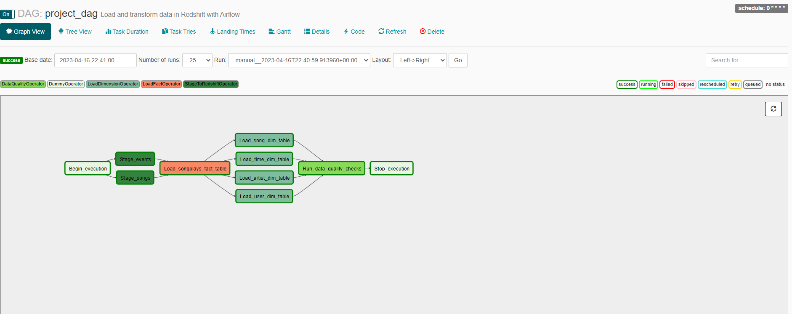

## Summary
Data Pipelines with Airflow
A music streaming company, Sparkify, has decided that it is time to introduce more automation and monitoring to their data warehouse ETL pipelines and come to the conclusion that the best tool to achieve this is Apache Airflow.

They have decided to bring you into the project and expect you to create high grade data pipelines that are dynamic and built from reusable tasks, can be monitored, and allow easy backfills. They have also noted that the data quality plays a big part when analyses are executed on top the data warehouse and want to run tests against their datasets after the ETL steps have been executed to catch any discrepancies in the datasets.

The source data resides in S3 and needs to be processed in Sparkify's data warehouse in Amazon Redshift. The source datasets consist of JSON logs that tell about user activity in the application and JSON metadata about the songs the users listen to.

## Project Implementation
In this project we are creating the ETL pipeline using Apache Airflow. The different stages of the pipeline
enables the business to perform data analysis on the Sparkify songs data.
<br/>
The first stage of the pipeline loads data into the staging tables of Redshift clusters from AWS S3 location
<br/>
In the second stage we are loading the Facts table
<br/>
In the third stage we are loading all the dimensions table
<br/>
Finally we are doing some data quality check on the data and ending the AirFlow job

##Pipeline



##Prerequsite
- Create and configure IAM user that will have Admin level access to AWS Redshift cluster and AWS S3
   - Create a Programmatic access key for this user
- Create and Configure Redshift Cluster
- Use create_tables.sql and create all the necessary tables in Redshift Cluster
- Use Airflow Admin UI and create AWS Credentials 
  - Connection ID: aws_credentials
  - Connection Type: AWS Webservices
  - Login : Access Key of IAM User
  - Password: Secret Key of IAM User
- Use Airflow Admin UI and create Redshift Connections
  - Connection ID: redshift
  - Connection Type: Postgres
  - Host: from Redshift Cluster
  - Schema: Schema from Redshift Cluster if defaulted will be dev
  - Login: DB user when creating the cluster
  - Password: Password of the admin user
  - Port: 5439


##Install
Python requirements
```
pip install -r requirements.txt
```

##AirFlow Run

- Once the pipeline is enabled, it will start the run as the schedule is set to hourly

##End
- Delete the Redshift Cluster
- Disable the Airflow job

