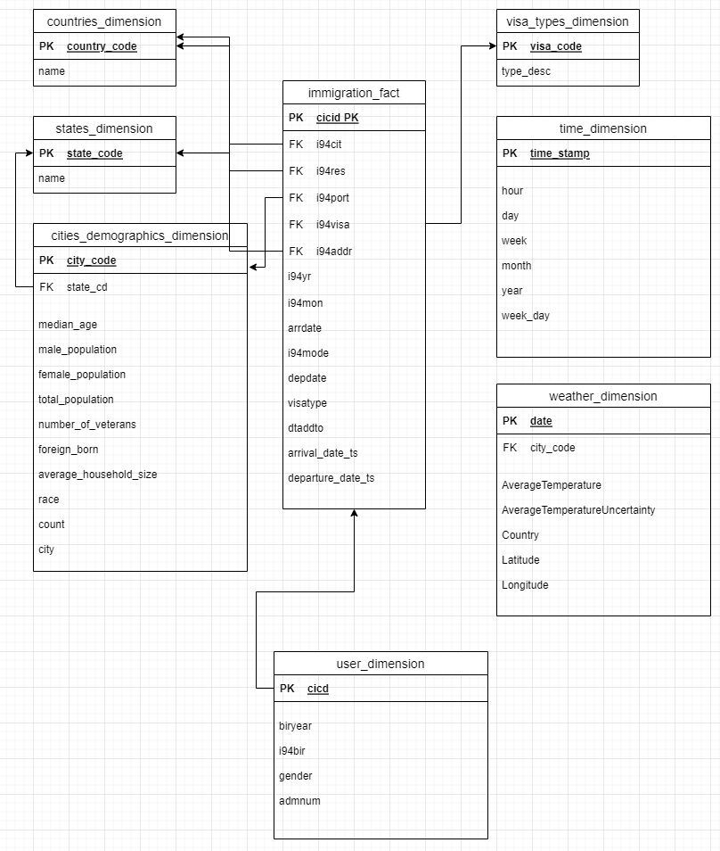

## Summary
In this project we provided Star schema model to analyse US Immigration data. By providing the Star schema model, users can anlyze the data as per the requirements. 

## Scope
In this project first we analysed the data. Based on the data that was provided and also the analysis 
- We decided to use PySPark to set up the ETL Pipeline
- The output of the ETL pipeline will be Apache Parquet format which can later be injected into RedShift for further analysis
- We have provided sufficient dimension tables, so that data can be analysed based on requirements

## Datasets:
- Immigration data is coming from the SAS Parquet files
- Weather data imported into the project as csv file GlobalLandTemperaturesByCity.csv
- Cities, VisaTypes, State, Countries Dimensions table data is sourced from I94_SAS_Labels_Descriptions.SAS
- Other Dimension table data is sourced from the Immigration data Parquet files
- ** Note, Weather data is not uploaded into Git to download the data go to
    https://www.kaggle.com/datasets/berkeleyearth/climate-change-earth-surface-temperature-data, download the file `GlobalLandTemperaturesByCity.csv` and place the file in the main folder before running the ETL process
## Star Schema


## Data Model
### Immigration Fact Table
cicid: double  
 i94yr: double (nullable = true)  
 i94mon: double (nullable = true)  
 i94cit: double (nullable = true)  
 i94res: double (nullable = true)  
 i94port: string (nullable = true)  
 arrdate: double (nullable = true)  
 i94mode: double (nullable = true)  
 i94addr: string (nullable = true)  
 depdate: double (nullable = true)  
 i94visa: double (nullable = true)  
 visatype: string (nullable = true)  
 dtaddto: string (nullable = true)  
 arrival_date_ts: timestamp (nullable = true)  
 departure_date_ts: timestamp (nullable = true)  

### Users Dimension table
 cicid: double   
  biryear: double (nullable = true)  
  i94bir: double (nullable = true)  
  gender: string (nullable = true)  
  admnum: double (nullable = true)  

### Countries Dimension table
 country_code: string  
 name: string (nullable = true)  

### State Dimension table
state_code: string (nullable = true)  
 name: string (nullable = true)  

### Cities Demographics Dimension table
city: string (nullable = true)  
 state_code: string (nullable = true)  
 male_population: long (nullable = true)  
 female_population: long (nullable = true)  
 total_population: long (nullable = true)  
 number_of_veterans: long (nullable = true)  
 foreign_born: long (nullable = true)  
 city_code: string   

### VisaType Dimension table
visa_code: string   
 type_desc: string (nullable = true)  

### Time Dimension table
 time_stamp: timestamp (nullable = true)  
 hour: integer (nullable = true)  
 day: integer (nullable = true)  
 week: integer (nullable = true)  
 month: integer (nullable = true)  
 year: integer (nullable = true)  
 weekday: integer (nullable = true)  

### Weather Dimension table
dt: date  
 AverageTemperature: double (nullable = true)  
 AverageTemperatureUncertainty: double (nullable = true)  
 City: string (nullable = true)  
 Country: string (nullable = true)  
 Latitude: integer (nullable = true)  
 Longitude: integer (nullable = true)  
 date: date (nullable = true)  
 city_code: string (nullable = true)  

## ETL Process
- Create the Spark Session
- Load the Immigration SAS Data using the Apache Parquet files as a Dataframe
- Use the Parquet Dataframe and construct our Immigration Fact table
- Use the Parquet Dataframe and create the Time, Users Dimension tables
- Parse the I94_SAS_Labels_Descriptions.SAS file and create the Countries, State, Cities Dimension tables
- Parse the GlobalLandTemperaturesByCity.csv to create the Weather Dimension table
- During the process do data quality checks as well 

## Project File
```
etl.py => Main Spark ETL process
utils.py => Contains utils function used by the ETL process
data_lake_analysis.ipynb => Jupyter Notebook that provides sample analysis of ETL output

```

## Running the Process
```
  pip install requirements.txt
  
  python3 etl.py
```

## Other Scenarios
#### The data was increased by 100x:
If the data size increased by 100x then we can create a Spark EMR cluster in AWS to injest the data.  
We can also injest the data into AWS Redshift Cluster to do further analysis

#### The pipelines would be run on a daily basis by 7 am every day:
We can crate an Apache Airflow process to run the ETL on schedule

#### The database needed to be accessed by 100+ people:
The best option for this is to injest the data into AWS Redshift Cluster, so that we can configure users to analyze the data


